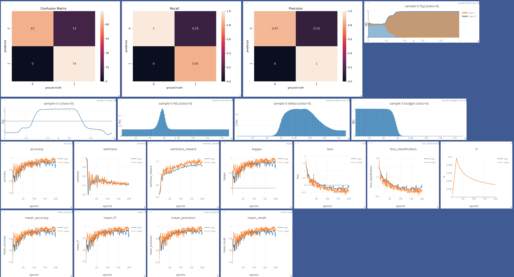
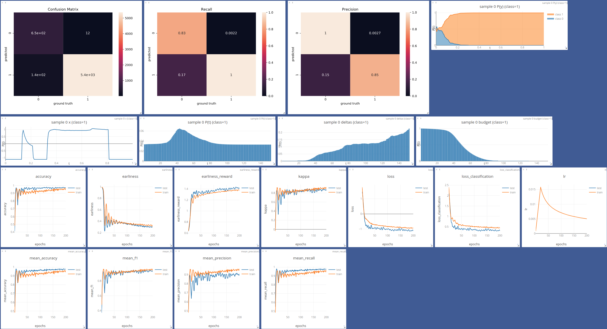
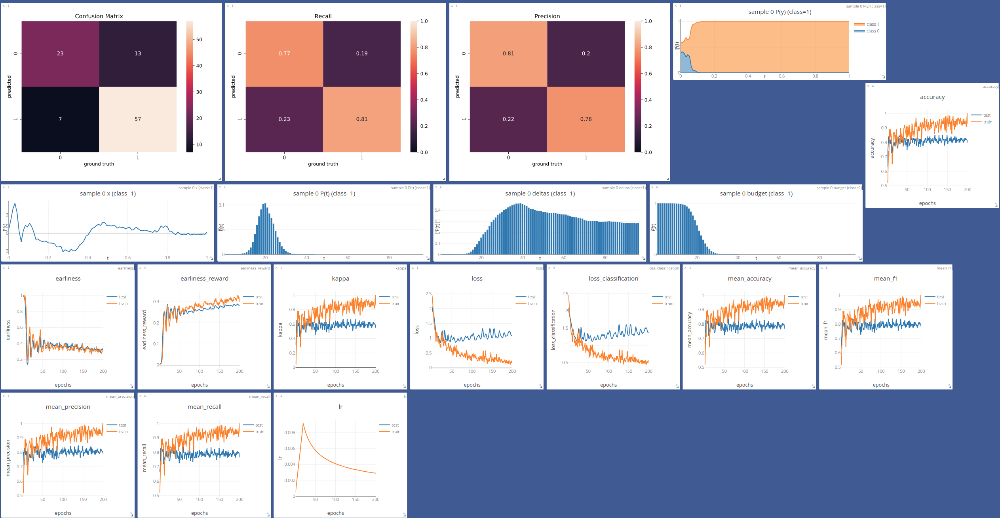
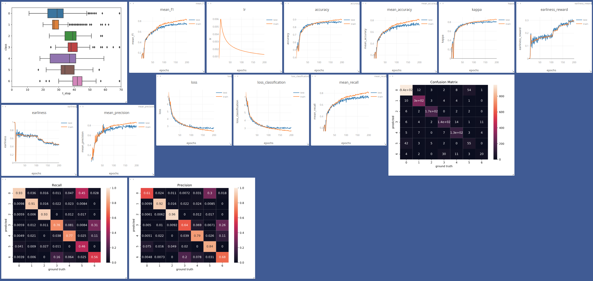

End-to-end Learning for Early Classification of Time Series (ELECTS)
===

Execute hyperparameter tuning and training
```
python main.py --model Conv1D --dataset GunPoint
```

Execute single run
```bash
train.py -d GunPoint -m Conv1D --store /tmp --batchsize 256 --overwrite
```


```bash
train.py -d BavarianCrops_uniform_2500 -m DualOutputRNN --loss-mode "early_reward" --store /tmp --batchsize 256 --overwrite
```


### Runs (visdom)

Gunpoint



Wafer



EGC



Remote Sensing Dataset




### Download data

```bash
wget https://corupublic.s3.eu-central-1.amazonaws.com/BavarianCropsHoll8.zip /data/
unzip /data/BavarianCropsHoll8.zip -d /data/
```

```bash
wget https://s3.eu-central-1.amazonaws.com/corupublic/early_rnn.zip
```